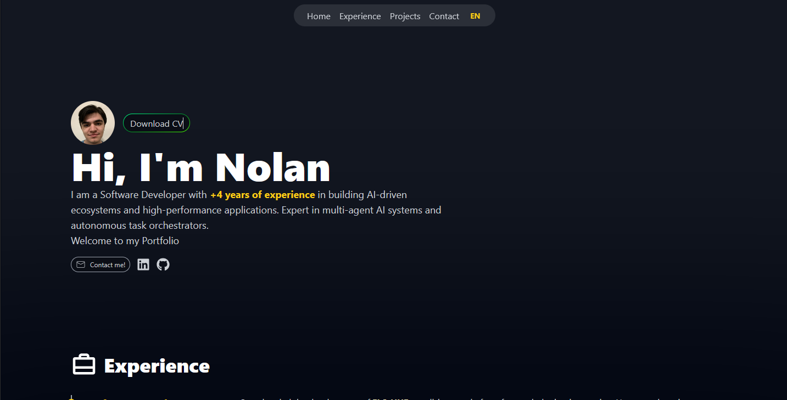

# 🚀 Nolan Ashcraft - Portfolio

Personal portfolio website showcasing my experience, projects, and skills as a Software Developer.

[](https://nolanashcraft.netlify.app/)



## 👨‍💻 About Me

Results-driven Software Developer with **2+ years of experience** designing, developing, and deploying scalable web applications across front-end and back-end environments. Strong foundation in Physics and analytical problem-solving, enabling data-driven decision-making and process optimization.

## ✨ Features

- 🌐 **Bilingual Support** - Full English/Spanish internationalization (i18n)
- 📱 **Responsive Design** - Optimized for all device sizes
- ⚡ **Fast Performance** - Built with Vite for optimal loading speeds
- 🎨 **Modern UI** - Clean design with Tailwind CSS
- 📊 **Google Analytics** - Integrated visitor tracking

## 🛠️ Tech Stack

| Category | Technologies |
|----------|-------------|
| **Frontend** | React 18, JavaScript, Tailwind CSS |
| **Build Tool** | Vite |
| **i18n** | i18next, react-i18next |
| **Icons** | React Icons |
| **Deployment** | Netlify |

## 🚀 Getting Started

### Prerequisites

- Node.js (v18 or higher recommended)
- npm or yarn

### Installation

1. **Clone the repository**
   ```bash
   git clone https://github.com/NolanS-OMG/portfolio.git
   cd portfolio
   ```

2. **Install dependencies**
   ```bash
   npm install
   ```

3. **Start development server**
   ```bash
   npm run dev
   ```

4. **Build for production**
   ```bash
   npm run build
   ```

5. **Preview production build**
   ```bash
   npm run preview
   ```

## 📁 Project Structure

```
├── public/
│   ├── profile.jpeg          # Profile picture
│   ├── CV_Nolan_Ashcraft.pdf # Downloadable CV
│   └── *.PNG                  # Project screenshots
├── src/
│   ├── Components/
│   │   ├── Experience.jsx    # Work experience timeline
│   │   └── Projects.jsx      # Projects showcase
│   ├── config/
│   │   ├── en.json           # English translations
│   │   └── es.json           # Spanish translations
│   ├── App.jsx               # Main application component
│   ├── i18config.js          # i18n configuration
│   ├── index.css             # Global styles
│   └── main.jsx              # Entry point
├── index.html
├── tailwind.config.js
├── vite.config.js
└── package.json
```

## 💼 Professional Experience

- **Hola ELO** - Software Developer (2024 - Present)
- **Innova Solutions** - Software Developer (2023 - 2024)
- **Innova Solutions** - Software Developer Intern (2022 - 2023)

## 🔧 Skills

**Languages & Frameworks:**
`HTML` `CSS` `JavaScript` `TypeScript` `React` `React Native` `Node.js` `Java` `Spring Boot` `Ruby on Rails` `Python`

**Cloud & Tools:**
`AWS` `Salesforce` `Jenkins` `Git`

**Data Science:**
`NumPy` `Matplotlib` `Pandas` `PyTorch`

## 📫 Contact

- 📧 Email: [nolan1scott3@gmail.com](mailto:nolan1scott3@gmail.com)
- 💼 LinkedIn: [nolan-ashcraft](https://www.linkedin.com/in/nolan-ashcraft-a25963234/)
- 🐙 GitHub: [NolanS-OMG](https://github.com/NolanS-OMG)

## 📄 License

This project is open source and available under the [MIT License](LICENSE).

---

⭐ If you found this portfolio helpful or inspiring, feel free to give it a star!